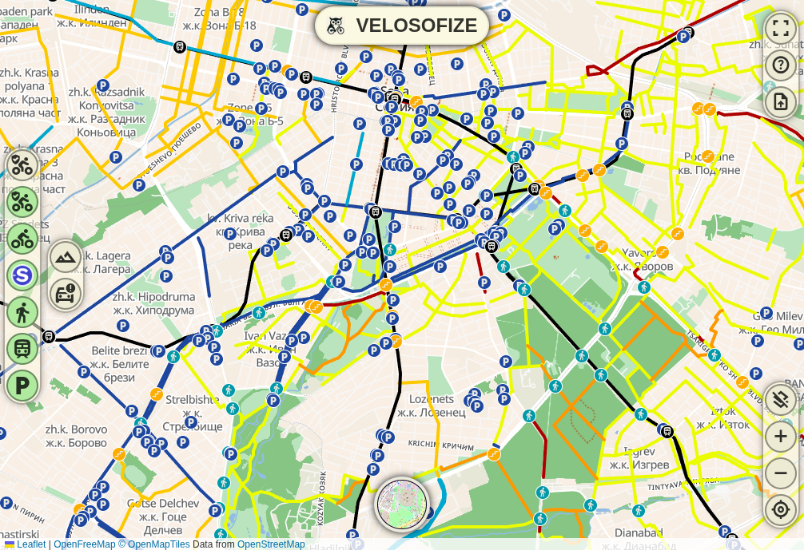

# Velosofize Map

A free effort to map the information that Bulgarian cyclists need to get around.

## Introduction

This repository serves as the frontend for the web app map.velosofize.com. It is intended as a free-to-use platform in the long-term which sources data from personal contributions of the project's creator, from Velosofize's and OpenStreetMap's contributors (also accessible in Google Maps and Google Earth).

The focus of the project is to gather as much information as possible that Bulgarian cyclists need, all in one place. It serves also as a catalogue of other projects in this niche. The data should be, as much as possible, accessible through apps that the majority of Bulgarian mobile users are already familiar with, e.g. browsers, Google Maps and Google Earth and the underlying routes are to be accessible for export so that users can make their own modifications.

The Velosofize project includes resources from other repositories, such as velosofist/velosofize and velosofist/velosofize-minima-theme , which account for the blog section of the website (docs.velosofize.com) and its styling.

## Projects used

The development of Velosofize Map in its current form would not be possible without the generous contributions to other free-to-use and/or open-source projects, including:

* [OpenStreetMap](https://www.openstreetmap.org/)
* [CyclOSM](https://www.cyclosm.org/)
* [OpenMapTiles](https://openmaptiles.github.io/)
* [OpenFreeMap](https://openfreemap.org/)
* [Leaflet.js](https://leafletjs.com)
* [Maplibre](https://maplibre.org/)
  * [Maputnik](https://maplibre.org/maputnik/)
* [Google My Maps](http://mymaps.google.com/)
* [Google Material Icons](https://fonts.google.com/icons)
* [geojson.io](https://geojson.io)
* [MapBox's togeojson tool](https://github.com/mapbox/togeojson)
* [Черна писта](https://chernapista.com)
* [Overpass Turbo](https://overpass-turbo.eu/)
* [Sofenhagen.com](https://sofenhagen.com)

and others. Further attributions will be added to NOTICES.md along with respective licenses. Attributions to other projects are included throughout the blog section of the website <docs.velosofize.com> , including in [the Alternatives section](https://docs.velosofize.com/bg/alternatives).

## Why KML format instead of GeoJson?

GeoJson as a format might seem like an obvious choice for the representation of the underlying data used in Velosofize. However, KML format (which is closely linked to the development of Google Earth) is used by default since it is the default format in Google My Maps, which will likely be used in the future to gather users' suggestions for new routes to be added to the map. I am, however, open to suggestions for a different stack on the users' side to gather suggested routes in GeoJson format. The existing KML files would be easy enough to convert using [MapBox's togeojson tool](https://github.com/mapbox/togeojson).

## Contributions

In case of interest in contributing, please see the [contributions page](https://docs.velosofize.com/en/contributions/) and reach out on GitHub or at <velosofize@gmail.com> .

